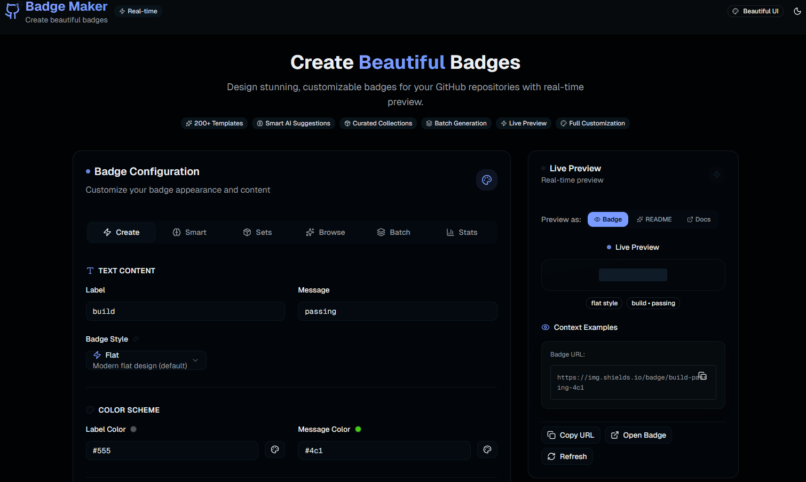

# 🏷️ GitHub Badge Maker

<!-- Product Status Badges -->
[](https://github-badge-maker.vercel.app)
[](https://github.com/Nom-nom-hub/github-badge-maker)

<!-- Technology Stack -->
[](https://nextjs.org/)
[](https://reactjs.org/)
[](https://www.typescriptlang.org/)
[](https://tailwindcss.com/)
[](https://ui.shadcn.com/)

<!-- Build & Quality Status -->
[](https://github.com/Nom-nom-hub/github-badge-maker/actions/workflows/ci.yml)
[](https://github.com/Nom-nom-hub/github-badge-maker/actions/workflows/release.yml)
[](https://github.com/Nom-nom-hub/github-badge-maker/actions/workflows/dependencies.yml)

<!-- Features & Stats -->
[](https://github.com/Nom-nom-hub/github-badge-maker)
[](https://github.com/Nom-nom-hub/github-badge-maker)
[](https://github.com/Nom-nom-hub/github-badge-maker)
[](https://github.com/Nom-nom-hub/github-badge-maker)

<!-- License & Community -->
[](https://opensource.org/licenses/MIT)
[](https://github.com/Nom-nom-hub/github-badge-maker)
[](https://github.com/Nom-nom-hub/github-badge-maker/blob/main/README.md#contributing)

A beautiful, intuitive GitHub badge maker with real-time preview and multiple export formats. Create stunning badges for your repositories with ease.

> 🎨 **All the badges above were created using this very tool!** Experience the power of real-time customization, extensive templates, and multiple export formats. 🚀

## ✨ Features

- 🎨 **Real-time Preview** - See your badge as you design it
- 📋 **Pre-built Templates** - Choose from dozens of common badge templates
- 🎛️ **Full Customization** - Control every aspect of your badge appearance
- 📱 **Responsive Design** - Works perfectly on desktop and mobile
- 🚀 **Multiple Export Formats** - Get your badge as URL, Markdown, HTML, or with links
- 🌈 **Color Picker** - Choose from preset colors or use custom hex values
- 📦 **Logo Support** - Add icons from popular services or custom SVGs
- ⚡ **Fast & Modern** - Built with Next.js 15 and shadcn/ui
- 🎨 **Custom Badge Designer** - Create unique SVG badges with full design control
- 🤖 **Automated Releases** - Semantic versioning with automated changelog generation

## 📸 Preview



*Create beautiful, customizable badges with real-time preview and multiple export options*

## 🚀 Quick Start

### Prerequisites

- Node.js 20.17 or later (required for Next.js 15)
- npm, yarn, or pnpm

### Installation

```bash
# Clone the repository
git clone https://github.com/username/github-badge-maker.git
cd github-badge-maker

# Install dependencies
npm install

# Start the development server
npm run dev
```

Open [http://localhost:3000](http://localhost:3000) to view the application.

## 📊 Usage Examples

### Creating Your First Badge

1. **Choose a Template** - Start with a pre-built template or create from scratch
2. **Customize** - Modify the label, message, colors, and style
3. **Preview** - See your badge update in real-time
4. **Export** - Copy the URL, Markdown, or HTML code

### Popular Badge Types

- **Build Status**: `build | passing` or `build | failing`
- **Version Numbers**: `version | v1.2.3`
- **License**: `license | MIT`
- **Technology Stack**: `made with | React`
- **Code Quality**: `code quality | A`
- **Test Coverage**: `coverage | 98%`

## 🎨 Badge Styles

- **Flat** - Modern, clean appearance (default)
- **Flat Square** - Flat style with square corners
- **For the Badge** - Large, rectangular badges
- **Plastic** - Glossy, 3D appearance
- **Social** - Social media style badges

## 🛠️ Technology Stack

- **Framework**: [Next.js 15](https://nextjs.org/) with App Router
- **UI Components**: [shadcn/ui](https://ui.shadcn.com/)
- **Styling**: [Tailwind CSS](https://tailwindcss.com/)
- **Icons**: [Lucide React](https://lucide.dev/)
- **Toast Notifications**: [Sonner](https://sonner.emilkowal.ski/)
- **Badge Generation**: [Shields.io](https://shields.io/) API
- **Deployment**: [Vercel](https://vercel.com/)

## 🔄 CI/CD Pipeline

### GitHub Actions Workflows

- **🔍 Code Quality**: ESLint, TypeScript checking, and code formatting
- **🏗️ Build & Test**: Automated building and testing on every push/PR
- **🔒 Security**: Automated security audits and dependency scanning
- **🚀 Deployment**: 
  - Preview deployments for pull requests
  - Production deployments for main branch
- **📦 Dependencies**: Automated dependency updates via Dependabot
- **🚨 Performance**: Lighthouse CI for performance monitoring
- **🏷️ Releases**: Automated semantic versioning and releases

### Badges for This Project

*All badges below were created using this GitHub Badge Maker! 🎨*

[](https://github.com/Nom-nom-hub/github-badge-maker/actions/workflows/ci.yml)
[](https://github.com/Nom-nom-hub/github-badge-maker/actions/workflows/release.yml)
[](https://github.com/Nom-nom-hub/github-badge-maker/actions/workflows/dependencies.yml)

### 🏷️ Showcase: Made with GitHub Badge Maker

<!-- Custom Product Badges -->
[](https://github-badge-maker.vercel.app)
[](https://github-badge-maker.vercel.app)
[](https://github-badge-maker.vercel.app)

<!-- Development Status -->
[](https://github.com/Nom-nom-hub/github-badge-maker)
[](https://github.com/Nom-nom-hub/github-badge-maker)
[](https://github.com/Nom-nom-hub/github-badge-maker)

<!-- Quality Metrics -->
[](https://github.com/Nom-nom-hub/github-badge-maker)
[](https://github.com/Nom-nom-hub/github-badge-maker)
[](https://github.com/Nom-nom-hub/github-badge-maker)

## 🛠️ Technology Stack

- **Framework**: [Next.js 15](https://nextjs.org/) with App Router
- **UI Components**: [shadcn/ui](https://ui.shadcn.com/)
- **Styling**: [Tailwind CSS](https://tailwindcss.com/)
- **Icons**: [Lucide React](https://lucide.dev/)
- **Toast Notifications**: [Sonner](https://sonner.emilkowal.ski/)
- **Badge Generation**: [Shields.io](https://shields.io/) API
- **Deployment**: [Vercel](https://vercel.com/)

## 📁 Project Structure

```
src/
├── app/
│   ├── api/
│   │   ├── badge/          # Badge generation API
│   │   └── templates/      # Template management API
│   ├── globals.css
│   ├── layout.tsx
│   └── page.tsx
├── components/
│   ├── ui/                 # shadcn/ui components
│   ├── badge-export.tsx    # Export functionality
│   ├── badge-form.tsx      # Badge configuration form
│   ├── badge-maker.tsx     # Main application component
│   ├── badge-preview.tsx   # Real-time preview
│   └── badge-templates.tsx # Template selector
└── lib/
    ├── badge-templates.ts  # Predefined templates
    ├── badge-utils.ts      # Badge generation utilities
    ├── types.ts            # TypeScript type definitions
    └── utils.ts            # General utilities
```

## 🚀 Deployment

### Deploy to Vercel

[](https://vercel.com/new/clone?repository-url=https://github.com/Nom-nom-hub/github-badge-maker)

*One-click deployment to showcase the power of modern web development! 🚀*

### Manual Deployment

```bash
# Build the project
npm run build

# Start the production server
npm start
```

### Environment Variables

No environment variables are required for basic functionality. The application uses the public Shields.io API for badge generation.

## 🤝 Contributing

Contributions are welcome! Please feel free to submit a Pull Request.

### Development Workflow

1. **Fork** the project
2. **Create** your feature branch (`git checkout -b feature/AmazingFeature`)
3. **Make** your changes following our coding standards
4. **Test** your changes locally:
   ```bash
   npm run lint        # Check code style
   npm run type-check  # Verify TypeScript
   npm run build      # Test build process
   ```
5. **Commit** your changes (`git commit -m 'Add some AmazingFeature'`)
6. **Push** to the branch (`git push origin feature/AmazingFeature`)
7. **Open** a Pull Request

### Automated Checks

Every pull request automatically runs:
- ✅ **ESLint** for code quality
- ✅ **TypeScript** compilation check
- ✅ **Build** verification
- ✅ **Security** audit
- ✅ **Lighthouse** performance testing
- ✅ **Preview** deployment

### Code Standards

- Follow **TypeScript** best practices
- Use **ESLint** configuration (runs automatically)
- Write **meaningful commit messages**
- Add **tests** for new features (when applicable)
- Update **documentation** as needed

### Issue Templates

- 🐛 **Bug Report**: Report bugs with detailed information
- ✨ **Feature Request**: Suggest new features or improvements

## 🔒 Security

- 🛡️ **Automated security audits** on every PR
- 📦 **Dependency vulnerability scanning**
- 🔄 **Regular dependency updates** via Dependabot
- 🚨 **Performance monitoring** with Lighthouse CI

## 🔄 Releases

Releases are automated using semantic versioning:
- **Patch** (`1.0.1`): Bug fixes
- **Minor** (`1.1.0`): New features
- **Major** (`2.0.0`): Breaking changes

Commit message format triggers appropriate version bumps:
- `feat:` → Minor version
- `fix:` → Patch version
- `feat!:` or `BREAKING CHANGE:` → Major version

## 📝 License

This project is licensed under the MIT License - see the [LICENSE](LICENSE) file for details.

## 🙏 Acknowledgments

- [Shields.io](https://shields.io/) for the excellent badge generation service
- [shadcn/ui](https://ui.shadcn.com/) for the beautiful UI components
- [Vercel](https://vercel.com/) for the amazing deployment platform
- [Next.js](https://nextjs.org/) team for the fantastic framework

## 📧 Support

If you have any questions or need help, please open an issue on GitHub.

---

Made with ❤️ by the GitHub Badge Maker team
